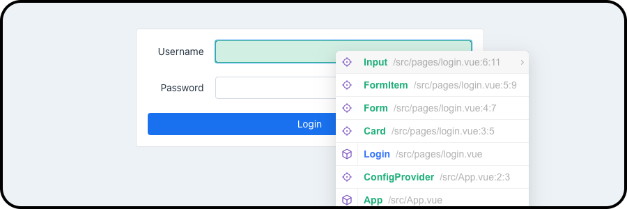

# vite-plugin-vue-inspector-plus

<center>
  
  <p>A Vite plugin that adds a shortcut dropdown menu for the Vue Inspector.</p>
</center>

## Installation

```bash
npm install vite-plugin-vue-inspector-plus --save-dev
```

## Usage

This plugin needs to be used with [Vue Devtools](https://github.com/vuejs/devtools) or [Vue Inspector](https://github.com/webfansplz/vite-plugin-vue-inspector).

```js
// vite.config.js

import { defineConfig } from 'vite';
import VueDevTools from 'vite-plugin-vue-devtools';
// import VueInspector from 'vite-plugin-vue-inspector';
import VueInspectorPlus from 'vite-plugin-vue-inspector-plus';

export default defineConfig({
  plugins: [
    VueDevTools(),
    // VueInspector(),
    VueInspectorPlus({
      // options
    }),
  ],
});
```

## Options

- modifierKey: `string` - The modifier key to show the inspector dropdown. Default: `'ctrl|meta'`.

## License

[MIT](./LICENSE)
